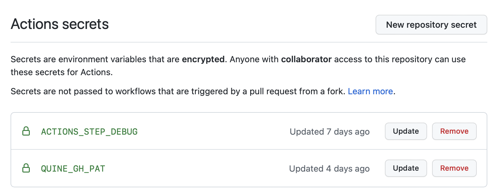

# Set up

## Prerequisites
- A GitHub Personal Access Token with repo: all and org: read scopes
- A forked GTD repo correctly set up

### Generating a PAT:
1. Go to https://github.com/settings/tokens.
2. Generate a new token. Name it `QUINE_GH_PAT`. We need the `repo:all` and `read:org` scopes.

3. Copy it and keep it for the next step. Note: it won't be available after close the tab.

**Q:** Why do you need a PAT? Couldn't you just use the default GitHub token?

**A:** We need read/write access to the repo's secrets in order to store the access tokens to Quine's API. Unfortunately, 
   you can't edit repository secrets using the default GitHub token supplied to Actions.

### Adding your PAT to GTD:
1. Go to `https://github.com/${YOUR_USERNAME}/gtd/settings/secrets/actions`.
2. Add a new secret. Name it `QUINE_GH_PAT` and paste the PAT generated in the previous step.
   

## Different ways of using the action
You can set up the action as a simple, standalone workflow, which will always publish the recommendations as a separate 
issue in GitHub, or have it integrated with GTD's Porter and publish the recommendations in the same issue as Porter. 

## Option A: Setting up the action in GTD's Porter workflow

1. In your private fork of GTD, open `gtd/.github/workflows/porter.yml` 
2. Create a new job step with the following parameters:
- `run-cron` (optional. Defaults to `* * * * *`): The action will only publish the recommendations if the current date matches the cron.
    - E.g. `* * * * 1` publishes every Monday (first day of the week). See https://crontab.guru/, if you need help with crons.
 - Notes:
    - The action only takes the month, week and day parameters into account, because this time pattern is dependent
      on the parent workflow cron.
    - We assume this value to be a subset of the parent workflow's cron. I.e., if the workflow's cron instructs
     GitHub to run the cron on every Tuesday, but this action is set to run on a daily basis, **the action will
      only run on Tuesdays**.
- `publish-in` (optional. Defaults to `porter-issue`): Where should the action publish your recommendations. Valid values: `separate-issue` and `porter-issue`.
  - `separate-ticket` example:
    
    
  - `porter-ticket` example:
    
- `gh-pat` (mandatory): Name (key) of the secret you stored in your private fork of **GTD**'s secret page 
- `quine-access-token` (mandatory): Access token used to authentify against Quine's API. This is completely managed by the action, 
  its name is hardcoded inside the action's code and its value in the .yml should always be `${{ secrets.QUINE_ACCESS_TOKEN}}`
- `quine-refresh-token` (mandatory): Same as `quine-access-token`. It is also hardcoded and its value should always be `${{ secrets.QUINE_REFRESH_TOKEN}}`

### Full working example of working porter.yml (just copy-paste):
```
name: Porter
on:
  workflow_dispatch:
    # ^^ so you can run this workflow manually if you need to
  schedule:
    - cron: '0 6 * * *' # The workflow runs every day at 6AM.
    # ^^ change this so it occurs while you’re sleeping (the timezone is UTC)
    # Syntax reference: https://crontab.guru

jobs:
  git-things-done:
    runs-on: ubuntu-latest
    outputs:
      today: ${{ steps.data.outputs.today }}
      yesterday: ${{ steps.data.outputs.yesterday }}
    steps:
      - uses: actions/checkout@v2
        with:
          fetch-depth: 0  #FIXME https://github.com/git-things-done/gtd/discussions/10
      - uses: git-things-done/porter@master
        id: data
      - name: Get current date
        id: date
        run: echo "::set-output name=date::$(date +'%Y-%m-%d')"
      - uses: quine-sh/quine-gtd-action@master
        id: quineGTD
        with:
          run-cron: "* * * * 1" # You will only get the recommendations on Mondays 
          publish-in: "separate-issue"
          gh-pat: ${{ secrets.QUINE_GH_PAT }}
          quine-access-token: ${{ secrets.QUINE_ACCESS_TOKEN}}
          quine-refresh-token: ${{ secrets.QUINE_REFRESH_TOKEN}}
      - uses: git-things-done/fortune@v1
      - uses: git-things-done/now-now@master

  gh-pages:
    runs-on: ubuntu-latest
    needs: git-things-done
    steps:
      - uses: DamianReeves/write-file-action@v1.0
        with:
          path: public/index.html
          contents: |
            <head>
              <meta http-equiv="refresh" content="0; URL=https://github.com/${{ github.repository }}/issues/${{  needs.git-things-done.outputs.today }}" />
            </head>
      - uses: DamianReeves/write-file-action@v1.0
        with:
          path: public/CURRENT
          contents: ${{  needs.git-things-done.outputs.today }}
      - uses: peaceiris/actions-gh-pages@v3
        with:
#         github_token: ${{ secrets.GITHUB_TOKEN }}
          personal_token: ${{ secrets.QUINE_GH_PAT }}
          external_repository: ${{ github.actor }}/${{ github.actor }}.github.io
          publish_dir: ./public
          destination_dir: gtd
          force_orphan: true
```

## Option B: Setting up the action as a separate workflow
1. In your private fork of GTD, create a file called `quine-gtd.yml` in `gtd/.github/workflows`
2. Use the example below to set up your workflow:
- note that using the action's `run-cron` parameter here would be redundant, as there's only one
action in this workflow. You have complete control just by using the workflow's `schedule` cron.
  
#### Full working job config
```
name: Quine repo recommendations
on:
  workflow_dispatch:
  schedule:
    - cron: '0 6 * * 1'
jobs:
  quine-repo-recommendations:
    runs-on: ubuntu-latest
    steps:
      - uses: actions/checkout@v2
        with:
          fetch-depth: 0  #FIXME https://github.com/git-things-done/gtd/discussions/10
      - uses: quine-sh/quine-gtd-action@master
        id: quineGTD
        with:
          publish-in: "separate-issue"
          gh-pat: ${{ secrets.QUINE_GH_PAT }}
          quine-access-token: ${{ secrets.QUINE_ACCESS_TOKEN}}
          quine-refresh-token: ${{ secrets.QUINE_REFRESH_TOKEN}}

```

## First run
The first time you run the workflow, you'll have to log in or sign up for a Quine account. Fortunately,
it's a one time thing. To do so:  
1. Manually start your workflow.
2. Wait for Quine's GTD action to run. You should see a message similar to this:
   
3. Click on the link and log in or sign up on our platform or just click on Confirm.
   
4. That's it! Come back to your GTD repo issues page and check out our recommended repos.

Note: we do use a refresh token to renew your access to our API, but it 
will go stale if not used for an extended period of time. In this case, your
workflow will fail. To renew it, just go through the authentication steps again (the links
should pop up in your Actions console).
